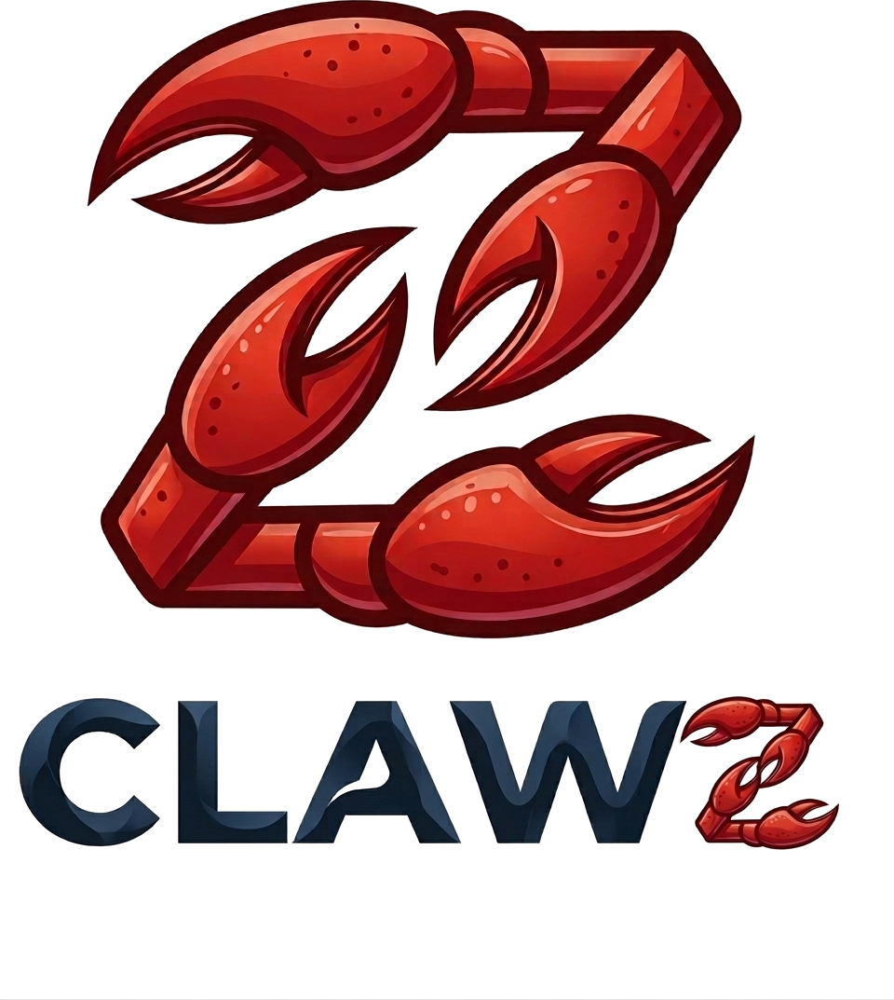
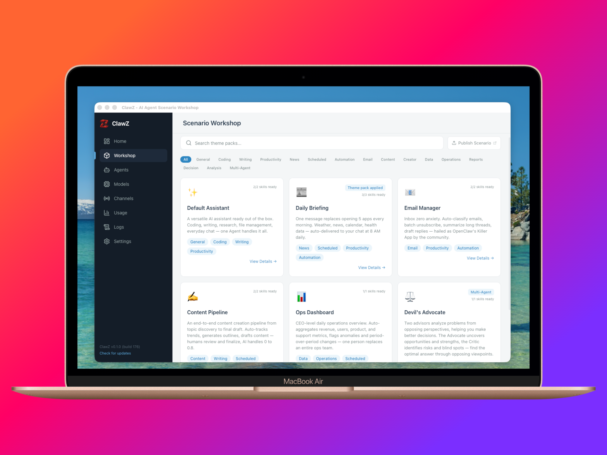

[English](README.md) | [中文](README.zh-CN.md)

<p align="center">
  
</p>

<p align="center">
  <strong>The desktop app that turns AI agents from command-line projects into working assistants.</strong><br/>
  Choose a scenario, connect a channel, deploy in 5 minutes — no terminal required.
</p>

<p align="center">
  <a href="https://github.com/clawz-ai/ClawZ/actions/workflows/check.yml"></a>
  <a href="https://github.com/clawz-ai/ClawZ/releases"></a>
  <a href="LICENSE"></a>
  
  <a href="CONTRIBUTING.md"></a>
</p>

<p align="center">
  
</p>

## Why ClawZ?

**🚀 Zero-Hassle Setup** — Get [OpenClaw](https://github.com/openclaw/openclaw) up and running in 5 minutes. ClawZ handles environment setup, dependency installation, and configuration — just download, launch, and follow the wizard.

**🎯 Scenario-Driven** — Don't start from scratch. Pick a pre-built scenario — daily briefing, email butler, content pipeline — and customize from there.

**🖥️ Visual Management** — Manage agents, models, channels, cron jobs, and costs through a clean GUI. No CLI memorization, no config file editing.

**🔒 Local & Private** — Bring any model provider. Connect any messaging channel. Everything runs locally — no cloud account, no telemetry, no lock-in.

## Features

<table>
<tr>
<td width="50%">

**🧙 Onboarding Wizard**<br/>
From zero to working agent in 5 minutes. Step-by-step guided setup handles everything automatically.

</td>
<td width="50%">

**🎨 Scenario Workshop**<br/>
6 built-in templates for common use cases. One-click deploy with persona, skills, and cron jobs pre-configured.

</td>
</tr>
<tr>
<td>

**🧠 Multi-Provider Models**<br/>
OpenAI, Anthropic, MiniMax, Zhipu, Qwen, and more. API key or one-click OAuth. Fallback chains for reliability.

</td>
<td>

**💬 Multi-Channel Messaging**<br/>
Telegram, Discord, Slack, Feishu, WhatsApp. Multiple bot accounts per channel with independent routing.

</td>
</tr>
<tr>
<td>

**⚡ Gateway Control**<br/>
Start, stop, restart, and monitor the OpenClaw gateway. One-click health checks and auto-recovery.

</td>
<td>

**📊 Cost Dashboard**<br/>
Track token usage and costs across all providers. Daily trends and per-model breakdown.

</td>
</tr>
<tr>
<td>

**👥 Multi-Agent Orchestration**<br/>
Deploy multi-agent scenarios with role-based routing and dedicated channels per agent.

</td>
<td>

**⏰ Cron Scheduling**<br/>
Visual cron job management. Create, edit, and monitor scheduled agent tasks.

</td>
</tr>
<tr>
<td>

**📋 Log Center**<br/>
Real-time log streaming with level filtering and keyword search.

</td>
<td>

**🛡️ Backup & Restore**<br/>
Export and import your entire configuration as a ZIP file. Experiment safely.

</td>
</tr>
<tr>
<td>

**🌐 Bilingual UI**<br/>
Full Chinese and English interface. Auto-detects system language.

</td>
<td>

**🖥️ Cross-Platform Desktop App**<br/>
Built with Tauri and Rust for native performance. macOS and Linux supported; Windows support planned.

</td>
</tr>
</table>

## Built-in Scenarios

| | Scenario | Description |
|---|----------|-------------|
| ✨ | **Default Assistant** | A versatile AI assistant ready out of the box. Coding, writing, research, file management, everyday chat — one agent handles it all. |
| 📰 | **Daily Briefing** | One message replaces opening 5 apps every morning. Weather, news, calendar, health data — auto-delivered to your chat at 8 AM daily. |
| 📧 | **Email Manager** | Inbox zero anxiety. Auto-classify emails, batch unsubscribe, summarize long threads, draft replies — hailed as OpenClaw's Killer App by the community. |
| ✍️ | **Content Pipeline** | An end-to-end content creation pipeline from topic discovery to final draft. AI handles 0 to 0.8, humans review and finalize. |
| 📊 | **Ops Dashboard** | CEO-level daily operations overview. Auto-aggregates revenue, users, product metrics, flags anomalies — one person replaces an entire ops team. |
| ⚖️ | **Devil's Advocate** | Two advisors analyze problems from opposing perspectives. The Advocate uncovers opportunities, the Critic identifies risks — find the optimal answer through debate. |

> Want to create your own? Scenarios are JSON files — see the [scenario schema](src/data/scenarios/schema.ts) for the format.

## Quick Start

### Download

Grab the latest release for your platform from the [Releases page](https://github.com/clawz-ai/ClawZ/releases).

| Platform | Format |
|----------|--------|
| macOS (Apple Silicon) | `.dmg` |
| macOS (Intel) | `.dmg` |
| Linux x86_64 (Ubuntu/Debian) | `.deb` |
| Linux x86_64 (Fedora/RHEL) | `.rpm` |
| Linux arm64 (Ubuntu/Debian) | `.deb` |
| Linux arm64 (Fedora/RHEL) | `.rpm` |

> Stable releases are notarized. If you need a temporary emergency build before notarization completes, use the GitHub prerelease noted in the release notes.

### System Requirements

| Platform | Minimum Version |
|----------|----------------|
| macOS (Intel) | macOS 10.15 Catalina |
| macOS (Apple Silicon) | macOS 11.0 Big Sur |
| Linux | Ubuntu 22.04 / Debian 12 / Fedora 36 (glibc 2.35+, WebKit2GTK 4.1+) |
| Windows | Coming soon |

### Build from Source

**Prerequisites:** [Node.js](https://nodejs.org/) `22.22.0` (see [`.nvmrc`](./.nvmrc)), [pnpm](https://pnpm.io/) >= 10, [Rust](https://rustup.rs/) >= 1.77, [Tauri prerequisites](https://v2.tauri.app/start/prerequisites/)

```bash
git clone https://github.com/clawz-ai/ClawZ.git
cd ClawZ
pnpm install --frozen-lockfile
pnpm tauri dev
```

For production builds: `pnpm tauri build` — output in `src-tauri/target/release/bundle/`.

## Tech Stack

| Layer | Technology |
|-------|-----------|
| Framework | [Tauri v2](https://tauri.app/) (Rust backend + Webview frontend) |
| Frontend | React 19 + TypeScript 5.9 + Vite 7 |
| Styling | Tailwind CSS v4 |
| State | Zustand v5 |
| CI | GitHub Actions (TypeScript + Vitest + Cargo Check + Clippy) |

## Supported Integrations

<details>
<summary><strong>Model Providers</strong> — OpenAI, Anthropic, MiniMax, Zhipu, Qwen (API Key + OAuth)</summary>

<br/>

| Provider | Auth Methods |
|----------|-------------|
| OpenAI | API Key, OAuth |
| Anthropic (Claude) | API Key, OAuth |
| MiniMax | API Key, OAuth |
| Zhipu AI (GLM) | API Key |
| Qwen (Tongyi) | API Key, OAuth |

Custom providers can be configured via the settings page.

</details>

<details>
<summary><strong>Messaging Channels</strong> — Telegram, Discord, Slack, Feishu, WhatsApp (+ 9 more in development)</summary>

<br/>

| Channel | Auth Type | Plugin Required |
|---------|-----------|----------------|
| Telegram | Bot Token | No |
| Discord | Bot Token | No |
| Feishu (Lark) | App ID + Secret | Yes (`@openclaw/feishu`) |
| Slack | Bot Token + App Token | No |
| WhatsApp | QR Code Login | No |

Additional channels (Signal, iMessage, MS Teams, Matrix, Google Chat, Mattermost, LINE, Nostr, IRC) are defined and coming soon.

</details>

## Contributing

We welcome contributions of all kinds — bug reports, feature requests, documentation improvements, and code.

- Read the [Contributing Guide](CONTRIBUTING.md) to get started
- Browse [open issues](https://github.com/clawz-ai/ClawZ/issues) — look for `good first issue` labels
- Review our [Code of Conduct](CODE_OF_CONDUCT.md)
- Report security vulnerabilities via [SECURITY.md](SECURITY.md)

## License

[MIT](LICENSE) — ClawZ is free and open source.

## Acknowledgments

ClawZ is built on top of the [OpenClaw](https://openclaw.ai) AI agent framework and powered by [Tauri](https://tauri.app/).
