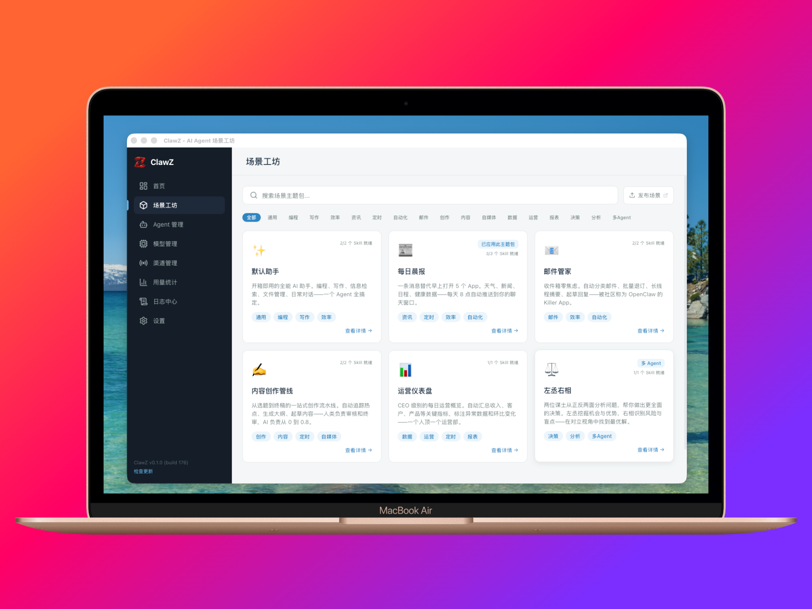

[English](README.md) | [中文](README.zh-CN.md)

<p align="center">
  
</p>

<p align="center">
  <strong>让 AI Agent 从命令行走向桌面——选个场景，5 分钟拥有你的 AI 助手。</strong><br/>
  <a href="https://github.com/openclaw/openclaw">OpenClaw</a> 场景工坊及可视化管理工具，下载即用，无需终端。
</p>

<p align="center">
  <a href="https://github.com/clawz-ai/ClawZ/actions/workflows/check.yml"></a>
  <a href="https://github.com/clawz-ai/ClawZ/releases"></a>
  <a href="LICENSE"></a>
  
  <a href="CONTRIBUTING.md"></a>
</p>

<p align="center">
  
</p>

## 为什么选择 ClawZ？

**🚀 零门槛安装** — 5 分钟搞定 [OpenClaw](https://github.com/openclaw/openclaw)。ClawZ 自动处理环境搭建、依赖安装和配置——下载、启动、跟着向导走就行。

**🎯 场景驱动** — 不用从零开始。选一个内置场景模板——每日晨报、邮件管家、内容创作管线——在此基础上自定义。

**🖥️ 可视化管理** — 通过图形界面管理 Agent、模型、渠道、定时任务和用量成本。无需记忆 CLI 命令，无需手编配置文件。

**🔒 本地运行** — 自由选择模型供应商和消息渠道。完全本地运行——无需云账户、无遥测、无锁定。

## 功能特性

<table>
<tr>
<td width="50%">

**🧙 引导式向导**<br/>
从零到可用只需 5 分钟。分步向导自动完成环境检测、安装和配置。

</td>
<td width="50%">

**🎨 场景工坊**<br/>
6 个内置场景模板，覆盖常见使用场景。一键部署，人设、技能、定时任务全部预配置。

</td>
</tr>
<tr>
<td>

**🧠 多供应商模型**<br/>
OpenAI、Anthropic、MiniMax、智谱、通义千问等。API Key 或一键 OAuth 授权，支持模型降级链。

</td>
<td>

**💬 多渠道消息**<br/>
Telegram、Discord、Slack、飞书、WhatsApp。每个渠道支持多个 Bot 账户，独立消息路由。

</td>
</tr>
<tr>
<td>

**⚡ 网关控制**<br/>
在应用内直接启动、停止、重启和监控 OpenClaw 网关。一键健康检查和自动恢复。

</td>
<td>

**📊 用量仪表盘**<br/>
跨供应商的 Token 用量和成本追踪。每日趋势图和按模型维度的明细统计。

</td>
</tr>
<tr>
<td>

**👥 多 Agent 编排**<br/>
部署多 Agent 场景，支持角色分工路由和独立渠道绑定。

</td>
<td>

**⏰ 定时任务**<br/>
可视化定时任务管理。创建、编辑和监控 Agent 的计划任务。

</td>
</tr>
<tr>
<td>

**📋 日志中心**<br/>
实时日志流，支持级别过滤和关键词搜索。

</td>
<td>

**🛡️ 备份与恢复**<br/>
将完整配置导出为 ZIP 文件并随时恢复。放心实验，不怕搞坏。

</td>
</tr>
<tr>
<td>

**🌐 中英双语**<br/>
完整的中文和英文界面，自动检测系统语言。

</td>
<td>

**🖥️ 跨平台**<br/>
支持 macOS、Linux 和 Windows。基于 Tauri + Rust 构建，原生性能。

</td>
</tr>
</table>

## 内置场景

| | 场景 | 说明 |
|---|------|------|
| ✨ | **默认助手** | 开箱即用的全能 AI 助手。编程、写作、信息检索、文件管理、日常对话——一个 Agent 全搞定。 |
| 📰 | **每日晨报** | 一条消息替代早上打开 5 个 App。天气、新闻、日程、健康数据——每天 8 点自动推送到你的聊天窗口。 |
| 📧 | **邮件管家** | 收件箱零焦虑。自动分类邮件、批量退订、长线程摘要、起草回复——被社区称为 OpenClaw 的 Killer App。 |
| ✍️ | **内容创作管线** | 从选题到终稿的一站式创作流水线。自动追踪热点、生成大纲、起草内容——AI 负责从 0 到 0.8，人类负责审核终审。 |
| 📊 | **运营仪表盘** | CEO 级别的每日运营概览。自动汇总收入、客户、产品等关键指标，标注异常数据——一个人顶一个运营部。 |
| ⚖️ | **左丞右相** | 两位谋士从正反两面分析问题。左丞挖掘机会与优势，右相识别风险与盲点——在对立视角中找到最优解。 |

> 想创建自己的场景？场景是 JSON 文件——查看[场景 Schema](src/data/scenarios/schema.ts) 了解格式。

## 快速开始

### 下载安装

前往 [Releases 页面](https://github.com/clawz-ai/ClawZ/releases) 下载适合你平台的最新版本。

| 平台 | 格式 |
|------|------|
| macOS (Apple Silicon) | `.dmg` |
| macOS (Intel) | `.dmg` |
| Windows | `.exe` 安装程序 |
| Linux | `.AppImage`, `.deb` |

> **macOS 用户：** 如果系统提示应用"已损坏"，请执行：`xattr -cr /Applications/ClawZ.app`

### 从源码构建

**环境要求：** [Node.js](https://nodejs.org/) >= 22、[pnpm](https://pnpm.io/) >= 10、[Rust](https://rustup.rs/) >= 1.77、[Tauri 依赖](https://v2.tauri.app/start/prerequisites/)

```bash
git clone https://github.com/clawz-ai/ClawZ.git
cd ClawZ
pnpm install
pnpm tauri dev
```

生产构建：`pnpm tauri build`，产物输出到 `src-tauri/target/release/bundle/`。

## 技术栈

| 层级 | 技术 |
|------|------|
| 桌面框架 | [Tauri v2](https://tauri.app/)（Rust 后端 + Webview 前端） |
| 前端 | React 19 + TypeScript 5.9 + Vite 7 |
| 样式 | Tailwind CSS v4 |
| 状态管理 | Zustand v5 |
| CI | GitHub Actions（TypeScript + Vitest + Cargo Check + Clippy） |

## 支持的集成

<details>
<summary><strong>模型供应商</strong> — OpenAI、Anthropic、MiniMax、智谱、通义千问（API Key + OAuth）</summary>

<br/>

| 供应商 | 认证方式 |
|--------|---------|
| OpenAI | API Key, OAuth |
| Anthropic (Claude) | API Key, OAuth |
| MiniMax | API Key, OAuth |
| 智谱 AI (GLM) | API Key |
| 通义千问 (Qwen) | API Key, OAuth |

可通过设置页面配置自定义供应商。

</details>

<details>
<summary><strong>消息渠道</strong> — Telegram、Discord、Slack、飞书、WhatsApp（另有 9 个渠道开发中）</summary>

<br/>

| 渠道 | 认证方式 | 需要插件 |
|------|---------|---------|
| Telegram | Bot Token | 否 |
| Discord | Bot Token | 否 |
| 飞书 (Lark) | App ID + Secret | 是 (`@openclaw/feishu`) |
| Slack | Bot Token + App Token | 否 |
| WhatsApp | 扫码登录 | 否 |

更多渠道（Signal、iMessage、MS Teams、Matrix、Google Chat、Mattermost、LINE、Nostr、IRC）已定义，即将开放。

</details>

## 参与贡献

我们欢迎各种形式的贡献——Bug 反馈、功能建议、文档完善和代码提交。

- 阅读[贡献指南](CONTRIBUTING.md)了解如何开始
- 浏览 [Issues](https://github.com/clawz-ai/ClawZ/issues)——寻找 `good first issue` 标签
- 查看[行为准则](CODE_OF_CONDUCT.md)
- 安全漏洞请通过 [SECURITY.md](SECURITY.md) 报告

## 许可证

[MIT](LICENSE) — ClawZ 是自由且开源的。

## 致谢

ClawZ 基于 [OpenClaw](https://openclaw.io) AI Agent 框架构建，由 [Tauri](https://tauri.app/) 驱动。
